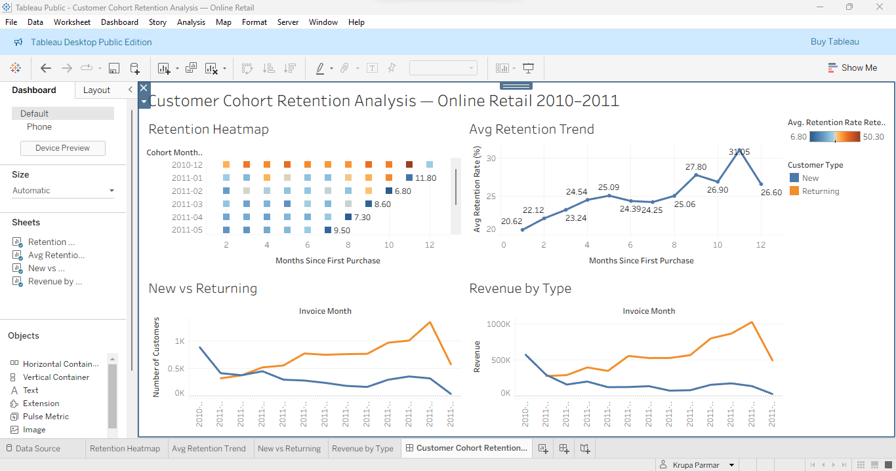

# Customer Cohort Retention Analysis ⚡

An end-to-end cohort retention analysis on 500K+ real e-commerce transactions from the UCI Online Retail dataset. Built to uncover customer retention patterns, revenue trends, and actionable business recommendations using Python and Tableau.

---

## Live Dashboard
🔗 [View on Tableau Public](https://public.tableau.com/app/profile/krupa.parmar8173/viz/CustomerCohortRetentionAnalysisOnlineRetail/CustomerCohortRetentionAnalysisOnlineRetail20102011)

---

## Key Findings

| Metric | Value |
|---|---|
| Total customers | 4,338 |
| Total revenue | £8,911,407 |
| Average order value | £480.87 |
| Avg Month-1 retention | 20.6% |
| Best cohort (Dec 2010) | 36.6% Month-1 retention |
| Worst cohort (Nov 2011) | 11.1% Month-1 retention |
| Retention trend | Increases over time (20.6% → 31.1%) |

---

## Business Insights

**1. 79.4% of customers are lost after the first purchase**
The single biggest retention problem. Month 1 is where the business loses most customers. An onboarding email sequence targeting first-time buyers could significantly improve this.

**2. December 2010 cohort is the strongest**
36.6% Month-1 retention vs 20.6% average. Worth investigating what drove acquisition and engagement in that period — seasonal promotions, product mix, or pricing.

**3. Long-term customers become more loyal over time**
Retention increases from 20.6% at Month 1 to 31.1% at Month 11. Customers who survive the first 6 months show consistently strong loyalty. A loyalty programme targeting the Month 6 milestone could accelerate this.

**4. Returning customer revenue dominates from mid-2011**
Returning customers generate significantly more revenue than new customers from mid-2011 onwards — confirming that retention investment has strong ROI for this business.

**5. Recommendation: Focus on Month 1 drop-off**
- Introduce post-purchase email sequence (Day 3, Day 7, Day 30)
- Loyalty incentive for second purchase within 30 days
- Personalised product recommendations based on first order

---

## Dashboard Preview



---

## Tech Stack

| Layer | Technology |
|---|---|
| Data cleaning & analysis | Python (Pandas, NumPy) |
| Cohort calculation | Python (Pandas pivot tables) |
| Visualisation | Tableau Public |
| Notebook | Jupyter Notebook |
| Dataset | UCI Online Retail (541,909 transactions) |

---

## Project Structure

```
cohort-retention-analysis/
├── cohort_analysis.ipynb      # Full analysis notebook
├── data/
│   └── online_retail.csv      # Raw dataset (UCI Online Retail)
├── exports/
│   ├── retention_long.csv     # Retention matrix (long format)
│   ├── revenue_long.csv       # Revenue matrix (long format)
│   ├── new_vs_returning.csv   # New vs returning customer data
│   └── avg_retention_trend.csv # Average retention by month
├── tableau/
│   └── screenshots/           # Dashboard screenshots
└── README.md
```

---

## Analysis Steps

**1. Data Cleaning**
- Removed 135,080 rows with missing CustomerID
- Removed returns (negative quantity) and cancellations (InvoiceNo starting with 'C')
- Removed zero-price transactions
- Result: 397,884 clean transactions across 4,338 customers

**2. Cohort Assignment**
- Each customer assigned to their first purchase month (cohort month)
- Cohort index calculated as months elapsed since first purchase

**3. Retention Matrix**
- Pivot table: cohort month × cohort index → unique customer count
- Retention rate = customers in month N / customers in month 0

**4. Revenue Analysis**
- Revenue aggregated by cohort and month index
- New vs returning customers split by comparing invoice month to first purchase month

**5. Visualisation**
- Retention heatmap (colour-coded by retention rate)
- Average retention trend line
- New vs returning customers over time
- New vs returning revenue over time

---

## Sample Queries

```python
# Cohort retention matrix
cohort_data = df_clean.groupby(['CohortMonth', 'CohortIndex'])['CustomerID'] \
                       .nunique().reset_index()
cohort_matrix = cohort_data.pivot_table(index='CohortMonth',
                                         columns='CohortIndex',
                                         values='Customers')
retention_matrix = cohort_matrix.divide(cohort_matrix.iloc[:, 0], axis=0).round(3) * 100

# Average retention by month
avg_retention = retention_matrix.mean().reset_index()
```

---

## Dataset

**UCI Online Retail Dataset**
- Source: [Kaggle](https://www.kaggle.com/datasets/vijayuv/onlineretail)
- Period: December 2010 – December 2011
- Records: 541,909 transactions
- Features: InvoiceNo, StockCode, Description, Quantity, InvoiceDate, UnitPrice, CustomerID, Country

---

## Author

**Krupa Ashoksinh Parmar** — Data Analyst | Python · SQL · Tableau · PostgreSQL

[](https://linkedin.com/in/krupa-parmar-a7996210a)
[](https://github.com/Krupa03)
[](https://public.tableau.com/app/profile/krupa.parmar8173/viz/CustomerCohortRetentionAnalysisOnlineRetail/CustomerCohortRetentionAnalysisOnlineRetail20102011)
